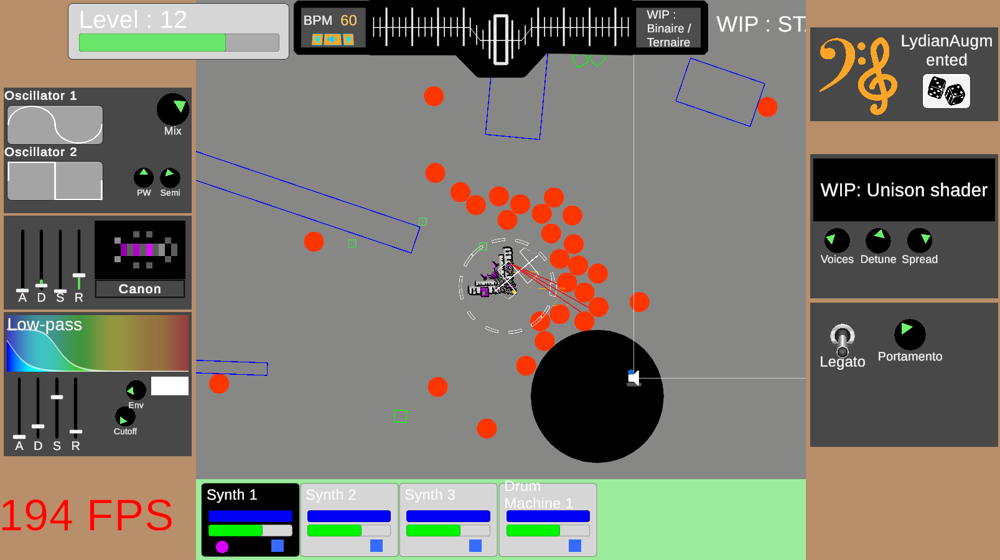

# Project M : Experimental project around musical games

This project aims to create an original experience and study the relationship between games and music. 
The goal is to create a game that uses musical perception to both drive the player's strategy and shape its configuration around the player's musical appetence.

